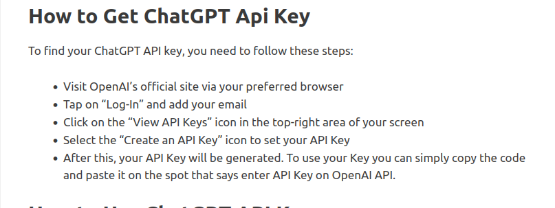
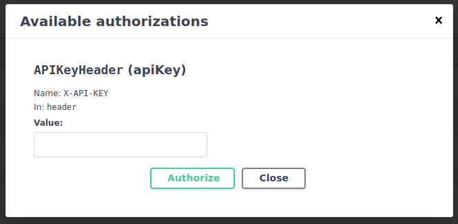
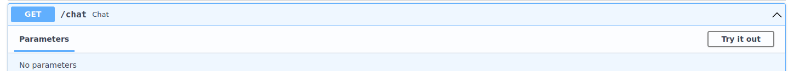
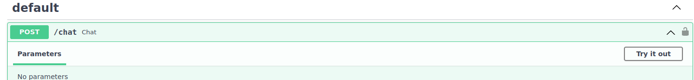

# "NiftyBridge AI assistant"
"Nifty Bridge AI Assistant" application based on GPT-3.5 using fastapi framework.
Designed to obtain information from a text document using a dialog.

## Installation
> **Note:** This instruction is for Linux and MacOS users.

1. Clone repository to your local machine.
```bash
git clone https://github.com/konoplia/test_task_for_DEVIT.git
```
Going to the root of the project, you should see the following project structure:
```bash
.
├── app
├── chat
├── constants.py
├── Dockerfile
├── .env
├── .env_example
├── .git
├── .gitignore
├── images
├── README.md
├── requirements.txt
├── tests.py
├── Untitled 5.pdf
└── venv
```
**Where:**  

**Untitled5.pdf** - file on the basis of which the chat will give answers. You should put your file instead of this one.  
also you need to put the name of the file in the **.env** file in the **PDF_FILE** variable. (see **.env_example** file as an example)


**File you can download** [here](https://www.dropbox.com/s/9npstuvp2vhnq4z/Untitled%205.pdf?dl=0).

> **Note:** Name of the file you should put in the **constants.py** file in the **PATH_TO_PDF** variable.
```
# path to pdf file
PATH_TO_PDF = "name_of_file.pdf"
```
**venv** - virtual environment folder which you can create by following command:
```bash
python3 -m venv venv
```
then activate it:
```bash
source venv/bin/activate
```
and install all requirements:
```bash
pip install -r requirements.txt
```
**.env** - file with environment variables. You should create it by yourself. Using **.env_example** file as an example.
In this file you should put your secret key from [OpenAI](https://beta.openai.com/).



```python
# .env
OPENAI_API_KEY='your OPENAI_API_KEY'
```


## Using Docker
Docker must be installed on your computer to complete this step.
Docker installation instructions can be found [here](https://docs.docker.com/engine/install/).  
1 - Build docker image:
```bash
docker build -t fastapi_image .
```
2 - Run docker container:
```bash
docker run -d --name my_container -p 8000:8000 --mount type=bind,source="$(pwd)",target=/code fastapi_image
```
After running the container, you can go to the [address](http://0.0.0.0:8000/docs#/) and see the documentation for the API.  

3 Authorization  
To get access to the API, you need to click on the **Authorize** button and enter your secret key from [OpenAI](https://beta.openai.com/).


## Using API
After authorization, you can use the API. API has two endpoints **/chat** GET and POST methods.  
**GET /chat** - provides you to get example which question are related to context.  
1. Using the **Try it out** button.
 
2. Using the **cURL** command.  
```bash
curl -X 'GET' \
  'http://0.0.0.0:8000/chat' \
  -H 'accept: application/json' \
  -H 'X-API-KEY: "your_secret_api_key"'
  ```

**POST /chat** -  provides the ability to communicate with the chatbot. 
You can use it in two ways:
1. Using the **Try it out** button.
 
2. Using the **cURL** command.
```bash
curl -X 'POST' \
  'http://0.0.0.0:8000/chat' \
  -H 'accept: application/json' \
  -H 'X-API-KEY: "your_secret_api_key"' \
  -H 'Content-Type: application/json' \
  -d '{
  "message": "What is the main idea of the company?"
}'
```
3. If the assistant can't find an answer or the question is out of context, it will return a message: "I don't know, please contact support by email support@nifty-bridge.com".

## Stop and start docker container
To stop docker container you should use following command:
```bash
docker stop my_container
```
To start docker container again you should use following command:
```bash
docker start my_container
```
## Local run
To run application locally you should use following command:
```bash
uvicorn app.main:app --reload
```
After running the application, you can do the same steps as in the **Using API** section.

## Tests
To run tests you should enter in bash of running container if you use docher, with following command:
```bash
docker exec -it my_container bash
```
Then you should run following command:
```bash
pytest tests.py
```
or open another terminal if you are run app localy and run following command:
```bash
pytest tests.py
```
